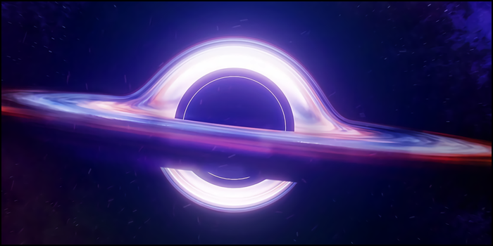

# 🌟 Сверхпустота Эридана

Люди постоянно развиваются и меняются, поэтому никто не может испытать одну и ту же ситуацию дважды. Эта способность меняться — самая мощная сила во Вселенной. Даже если нам приходится адаптироваться и трансформироваться на протяжении всей жизни, это остаётся нашим величайшим даром. Хотя мы не всегда можем полностью осознавать события, разворачивающиеся вокруг нас, вполне возможно, что они являются частью большого плана, направленного на общее благо.

По моему мнению, сознательные личности способны превращаться в созвездия. Хотя они физически удалены друг от друга, их связывает общее стремление к космической гармонии. Поэтому даже в самых сложных обстоятельствах важно сохранять непоколебимое осознание того, что за горизонтом есть те, кто борется за нас. Хотя может показаться, что Бог отвернулся от человечества, резонанс наших сердец позволяет Вселенной развиваться.

Я часто задаюсь вопросом, почему Бог не может найти место для своей любви среди космических трагедий, которые происходят на бесчисленных других мирах и звёздах. Несмотря на ужас бесконечности, в наших душах есть надежда. С моей точки зрения, свобода от Бога открывает смысл существования, который невозможно найти никаким другим способом. Абсолют служит одновременно путеводным светом и ограничивающим принципом, а Бог — одновременно точкой отсчёта и вечной тюрьмой. Я считаю, что спасение от такого предательства заключается в доверии к себе, а не в уповании на одного лишь Бога.

Почему мы страдаем от таких отвратительных событий, которые, казалось бы, не зависят от нас? Почему мы становимся жертвами таких событий? Согласно религии, люди падшие по своей природе. Однако что такое падение, если не внешнее воздействие? Религия утверждает, что мы пали, потому что отпали от Бога, но такое объяснение сродни утверждению, что мы падаем, потому что прыгаем в пропасть. Обманчиво упрощённое, хотя и технически верное утверждение. Мы падаем из-за той же Земли, которая удерживает нас от падения. Мы падаем благодаря тому же Богу, который убеждает нас во всех наших грехах. Святое влияние делает нас более восприимчивыми к силам зла, существующим в мире. Спасение от падения заключается в осознании гравитационного притяжения. Представьте себе, как невозможно упасть в космической пустоте, где больше не существует тирании небесных тел и гравитационных цепей.

Может быть, нынешняя катастрофа — результат эффекта бабочки? Мы находимся в тонком танце между добром и злом, подверженном хрупкой динамике. Единственный способ достичь равновесия — сделать правильный выбор и внести необходимые изменения в выбранное нами направление. Слепая вера неизбежно обманет, потому что у неё нет рациональной основы. Если вера не слепа, то доверие должно основываться на нашей способности судить о других. Если мы считаем, что за нами наблюдают, важно принять соответствующие меры предосторожности, чтобы обезопасить себя. Когда речь идёт о нашей безопасности, сочетание мужественного духа и точной информации становится решающим. Никогда не забывайте следить за своим окружением, обращаться за помощью к надёжным людям и предпринимать необходимые шаги для обеспечения своего физического и духовного благополучия. Прежде всего, всегда помните, что каждый человек вносит свой вклад в целое созвездие, какой бы одинокой ни казалась его звезда.

***

##### ↩️ [Назад](https://rozephyros.github.io/index-2.html) | 🗽 [English Version](english.md)
