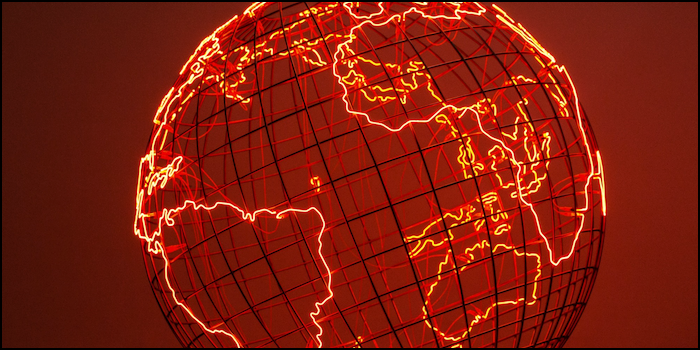

# 🌍 Энтропийная Борьба

#### <i>«История — неумолимый хозяин. У неё нет настоящего, только прошлое, устремляющееся в будущее. Пытаться удержаться — значит быть сметённым.»</i>

Причина катастрофических мировых войн кроется не в ограничениях капитала и производства, а в структуре политических институтов того времени. Начало и середина ХХ века были отмечены необычайными возможностями для экономического развития, обусловленными неудержимым движением технического прогресса. 

По мере усложнения общества хаос и беспорядок, часто называемые энтропией, проникали в различные аспекты социальной динамики. Интеграция энтропии в политическую систему путем реформ возможна, но интеграция энтропии неизбежно ведет к демократизации общества и появлению новых центров влияния. Столкнувшись с риском потерять власть, политики прибегают к реакционным методам. В отчаянной попытке сохранить свои позиции они подавляют свободу или вступают в конфликты с соседними странами, экспортируя энтропию во внешний мир.

Мировые войны, инициированные власть имущими, в конечном итоге приводят к их краху. Этот трагический цикл борьбы за власть и сопротивления прогрессу можно проследить на примере недавней ситуации с российскими институтами. Политики оказались перед выбором: либо поддержать развитие, смирившись с появлением новых центров влияния в обществе, либо сохранить существующую структуру власти, вступив в обреченный конфликт с постоянно меняющейся реальностью. Решение российских властей хорошо известно, и его последствия очевидны в ситуации на Украине.

Эта проблема касается не только России. Китай, выходя на уровень среднего дохода, также постепенно исчерпывает свой экономический потенциал в рамках старой парадигмы. Точно так же и западная система с трудом адаптируется к усложнению западного общества и международной политики, что также становится для неё экзистенциальным вызовом. В такой сложной обстановке наибольшие шансы на выживание и процветание имеют те государства, которые осознают необходимость адаптации и принимают силы прогресса.

***

##### ↩️ [Назад](https://rozephyros.github.io/index-2.html) | 🗽 [English Version](english.md)
