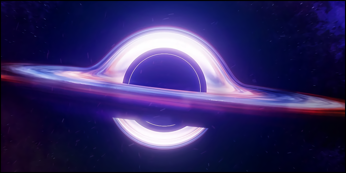

# 🌌 𝕰𝖗𝖎𝖉𝖆𝖓𝖚𝖘 𝕾𝖚𝖕𝖊𝖗𝖛𝖔𝖎𝖉

#### <i>“No man ever enters the same river twice. Man’s ability to change is the most powerful force in the universe. Even if we have to change for the rest of our lives, it remains our greatest gift.”</i>

Although we may not fully understand what is happening, it is possible that it is all part of a larger plan for the common good. Conscious people, in my opinion, are capable of becoming constellations. Distant from each other, but connected by a mutual desire for cosmic harmony. Therefore, even in the most difficult situations, it is important to have a firm awareness that far beyond the horizon there are those who are fighting for you. God may turn His back on people, but the resonance of hearts will allow the universe to evolve. I wonder if God wonders where his love has gone in the midst of a cosmic tragedy that could have occurred on an infinite number of other worlds and stars.

Although the situation seems dire, there is hope sleeping in our souls. From my perspective, the betrayal of God reveals a meaning to existence that cannot be found any other way. The Absolute is both a guiding light and a limiting principle. God is both a point of reference and an eternal prison. Why does something so vile and seemingly beyond our control happen to us? Why do we become victims of such events? According to religion, human beings are fallen creatures by nature. But what is fallen if not an outside influence? Imagine yourself in a cosmic void. There is nowhere to fall because there is no longer the tyranny of celestial bodies and chains of gravity.

Religion claims that we fall because we distance ourselves from God, but that's like claiming that we fall because we jump off a cliff. Technically true, but deceptively primitive. We fall because of the same Earth that keeps us from falling. We fall because of the same God who convinces us of all our sins. God’s influence makes us more vulnerable to the forces of evil that exist in the world. The cure lies in an awareness of our own gravity. Could the current catastrophe be the result of a butterfly effect? We are in a state of fragile dynamics between good and evil. The only way out is a balance through making the right changes in the direction we choose.

I think there is salvation from such a betrayal, and it lies in trusting in ourselves rather than in God. Blind faith will sooner or later be deceived because it has no rational basis. If it is not blind faith, then all trust is built on faith in one’s ability to judge others. If you believe you are being watched, you must take appropriate precautions to protect yourself. When it comes to keeping yourself safe, courage of spirit and having the right information becomes a powerful combination. Never forget to gather clues around you, seek help from trustworthy mortals, and take the necessary steps to ensure your bodily and spiritual safety. Most importantly, always remember that you are creating an entire constellation, no matter how lonely your star may be.

***

##### ↩️ [Back](https://rozephyros.github.io/index-2.html) | 🌻 [Русская Версия](russian.md)
