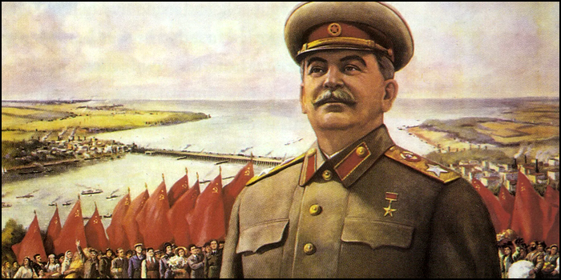

# ⚔️ 𝖂𝖊 𝕳𝖆𝖉 𝕹𝖔 𝕮𝖍𝖔𝖎𝖈𝖊

#### <i>“For a world tired of conflict, the best source of hope is a leader who achieves the impossible.”</i>

“We had no choice.†Stalin, who was in a much worse situation, never said anything like that. I read his speech on the outbreak of war, and not once did Stalin say that the Soviet people were deprived of historical choices. Stalin talked a lot about what the Soviet people had to do to win. He spoke of the need to organize the struggle and strengthen the country. This is the speech of a man who sees the future, understands the importance of decisions and points to appropriate action. What does he say about the possible and the impossible? Stalin stresses that a peace-loving country cannot refuse a peace treaty with a neighboring power, even if that power is headed by such monsters and cannibals as Hitler.

A peace-loving power cannot follow the path of betrayal. Stalin argues that the historic speeches of Britain and America in support of the Soviet Union can only instill gratitude in the hearts of the Soviet people. The moral imperative encourages Soviet people to be courageous and aware of the danger that threatens the country. There is no choice but to act according to one’s conscience. No matter how one feels about Stalin, this is the speech of a leader seeking to organize people in difficult times, emphasizing the importance of making moral decisions. It is a call to arms that will only be effective if everyone in the country understands the importance of courage and discipline. In this respect, Stalin’s speech was extremely powerful.

It is fair to compare Stalin’s speech with that of Putin. Our president also speaks of choice. Putin mentions two outside forces that made historic choices. America chose chemical weapons as a pretext to invade Iraq, and the people of Sevastopol chose to join Russia. Putin is not thinking about whether Russia can win, but about the difficult circumstances that absolve him of responsibility. Russia has no initiative, but is obliged to respond if the enemy tries to threaten, but has no initiative. The response would be unprecedented. There is no doubt that an attack on our homeland would have terrible consequences for the enemy. This is the speech of a man who wants to intimidate his enemies, even as he addresses his citizens.

What does our president call possible? Putin discusses possible threats from the West and options for countering them. More precisely, he leaves Russia only one option to choose from. After all, as it turns out, we have no choice but a military operation. Thus, Ukraine is responsible for the bloodshed that follows. This ominous statement underscores the need for preventive action. It is as if Putin is speaking to us from another dimension, unknown to humans, and predicts great catastrophes if the gears of historical destiny are not broken. This is the speech of a leader who does not believe in the independence of the Russian people at a time when the eyes of the world are on Russia.

***

##### ↩️ [Back](https://rozephyros.github.io/index-2.html) | 🌻 [Русская Версия](russian.md)
