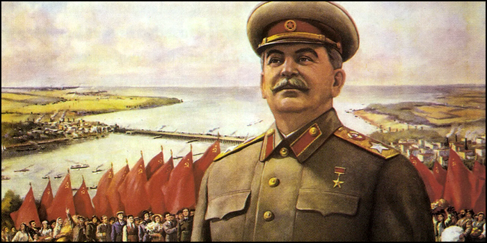

# 🇷🇺 У Нас Не Было Выбора

#### <i>«Для мира, уставшего от конфликтов, лучший источник надежды — лидер, который добивается невозможного.»</i>

«У нас не было выбора.» Сталин, который находился в гораздо худшей ситуации, никогда не говорил ничего подобного. Я читал его речь о начале войны, и ни разу Сталин не сказал, что советский народ был лишён исторического выбора. Сталин много говорил о том, что советский народ должен сделать для победы. Он говорил о необходимости организовать борьбу и укрепить страну. Это речь человека, который видит будущее, понимает важность решений и указывает на соответствующие действия. Что он говорит о возможном и невозможном? Сталин подчёркивает, что миролюбивая страна не может отказаться от мирного договора с соседней державой, даже если во главе этой державы стоят такие чудовища и людоеды, как Гитлер.

Миролюбивая держава не может идти по пути предательства. Сталин утверждает, что исторические выступления Великобритании и Америки в поддержку Советского Союза могут только вселить благодарность в сердца советских людей. Моральный императив побуждает советских людей к мужеству и осознанию опасности, которая угрожает стране. Нет иного выбора, кроме как действовать в соответствии со своей совестью. Как бы кто ни относился к Сталину, это речь лидера, стремящегося организовать людей в трудные времена, подчёркивающего важность принятия нравственных решений. Это призыв к оружию, который будет действенным только в том случае, если каждый житель страны поймёт важность мужества и дисциплины. В этом отношении речь Сталина была чрезвычайно мощной.

Справедливо сравнить речь Сталина с речью Путина. Наш президент также говорит о выборе. Путин упоминает две внешние силы, которые сделали исторический выбор. Америка выбрала химическое оружие в качестве предлога для вторжения в Ирак, а народ Севастополя выбрал присоединение к России. Путин думает не о том, сможет ли Россия победить, а о сложных обстоятельствах, которые снимают с него ответственность. Россия не имеет инициативы, но обязана ответить, если противник пытается угрожать, но не имеет инициативы. Ответ будет беспрецедентным. Нет сомнений, что нападение на нашу родину имело бы ужасные последствия для врага. Это речь человека, который хочет запугать своих врагов, даже когда он обращается к своим гражданам.

Что наш президент называет возможным? Путин обсуждает возможные угрозы со стороны Запада и варианты противодействия им. Точнее, он оставляет России только один вариант на выбор. Ведь, как выясняется, у нас нет иного выбора, кроме военной операции. Таким образом, Украина несёт ответственность за последующее кровопролитие. Это зловещее заявление подчёркивает необходимость превентивных действий. Путин как будто говорит с нами из другого измерения, неизвестного людям, и предсказывает великие катастрофы, если шестерёнки исторической судьбы не будут сломаны. Это речь лидера, который не верит в независимость российского народа в то время, когда взоры всего мира обращены к России.

***

##### ↩️ [Назад](https://rozephyros.github.io/index-2.html) | 🗽 [English Version](english.md)
