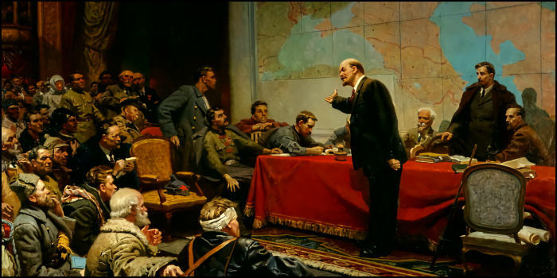

# 🌹 Героическое Предательство

#### <i>«Мы переживаем радость и боль нашего существования как один человек с миллионом сердец.»</i>

Патриотизм определяется как любовь к стране, но элиты всегда хотят заменить любовь лояльностью к определённому государственному режиму. Элиты в ужасе от того, что произойдёт, если люди обретут свободу и независимость. Архитекторы нашего угнетения хотят, чтобы наша любовь друг к другу служила их обогащению. Пророки не хотят, чтобы вы подвергали сомнению легенды о том, что они были избраны богами. Должны ли мы обманывать людей и делать вид, что патриот должен подчиняться власти? Историческое наследие Ленина поможет положить конец бесконечным спорам. После революции Ленин стал патриотом социалистического отечества. Был ли Ленин патриотом во время революции? Или он стал патриотом после создания Советов?

Люди, захватившие власть, не были патриотами монархии, и Ленин не был патриотом монархии. Они также не могли быть патриотами Советского Союза, который в то время даже не существовал в их воображении. Такая политическая структура, как Советский Союз, была немыслима до тех пор, пока условия в России не позволили радикальным идеям найти практическое выражение. Рабочие и крестьяне, недовольные старым миром, помогли основать Коммунистическую Партию, которой удалось полностью уничтожить буржуазный режим. У них были все основания объединиться с врагом режима и бороться против собственного правительства. Как ещё они могли действовать в системе, которая их отвергала?

Ленина так же часто обвиняют в предательстве, как и считают его спасителем нации. Можно только гадать о чувствах революционера, но последствия его действий, которые привели к драматическому краху тысячелетней истории страны, неоспоримы. Ленин поддерживал советскую власть, но никогда — монархию или династию. Согласие с патриотизмом Ленина приводит к выводу, что было время, когда русский патриот мог выступать против Российской Империи. А поскольку планы Ленина о Советском Союзе возникли не сразу, даже после победы революции, он не может быть советским патриотом. Как же тогда мог существовать ленинский патриотизм, уже отрицающий монархию, но ещё без красного флага?

Ленин решил предать презираемое правительство. Как же ему удалось стать символом народа? До него патриот не должен был выступать против монархии, не отрекаясь от русского народа, отдавшего жизнь за создание священного союза православия, самодержавия и народности. Однако на смену официозной традиции пришла великая идея социализма. Ленин в революционный период был патриотом умозрительного «социалистического Отечества», но почему старая страна или старый режим перестали быть для патриота «Отечеством»? Дело в том, что монархические представления о патриотизме были поверхностными. Государственный и показной патриотизм ориентировался на музейные ценности, а не на живые устремления: жертвенность, созидание, свободу, достоинство, верность.

Кому принадлежит понятие «служение Отечеству»? Ленин называл разрушение российского государства этапом революции, призванным обеспечить возрождение нации, а не её забвение. На карту была поставлена судьба нации. Это была не столько идеологическая прихоть, сколько вопрос выживания. Как человек может пронести через века больше, чем любой другой смертный? На протяжении тысячелетий люди размышляли о том, как достичь вечности. Кто определяет, что значит быть страной, нацией или народом? Патриот не должен быть просто патриотом государства, не может быть патриотом только определённого режима и не достоин оставаться только патриотом прошлого.

Чтобы показать свою любовь к Советской Родине, нашим предкам приходилось сражаться под красными флагами. История революции ответила на вопрос о патриотизме, но её уроки были забыты. В советское время слово «патриотизм» утратило свой активный и созидательный оттенок. Герои жили и умирали не за абстрактные идеи, они жили и умирали в решающий момент и за братское единство. Истинный патриот находится в гармонии с историей и в близости со своими товарищами. Единственное место для самого верного и преданного патриота — в окопах исторической борьбы. Глубокая любовь ставит нацию выше интересов правительства, и борьба с прошлым достигает кульминации, становясь исторической неизбежностью.

***

##### ↩️ [Назад](https://rozephyros.github.io/index-2.html) | 🗽 [English Version](english.md)
