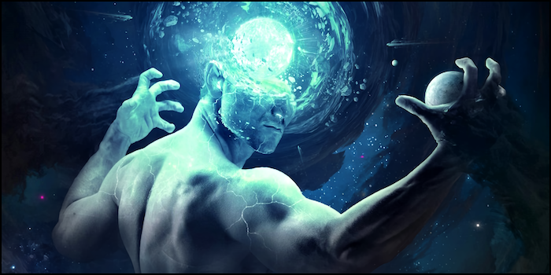

# 💬 𝕻𝖔𝖑𝖊𝖒𝖎𝖈𝖆𝖑 𝕸𝖎𝖘𝖘𝖎𝖔𝖓

#### <i>“No one will remember what you said. What you did will be forgotten. People will always remember only what you made them feel.”</i>

Passionate debate is a great tool for pushing the boundaries of thinking and generating fascinating ideas. Polemic as a form of rhetoric touches on controversial issues to elicit a response. It enlivens both friendly conversations and formal debates. Polemics is reflected in essays, articles, and books, becoming a tool for growth and introspection. By engaging in an honest and open dialogue with reality, one can gain a new perspective on the world and question one’s assumptions and beliefs. The goal of polemic is to question everything, even the very nature of truth. Inspirational polemic convinces us that nothing is sacred and that everything is up for debate.

The danger of polemics lies in its tendency to inspire a sense of absolute certainty and infallibility. Narrow-mindedness manifests itself in an unwillingness to engage in meaningful dialogue. Rhetoric used to discredit or silence becomes toxic and destroys the very ideals it was trying to uphold. This attitude often prevails in political discourse, where one side is in the minority and the other in the majority. Rhetorical arguments aimed at imposing sacred truths and destroying the beliefs of others are accompanied by scorn or attack. This leads to a spiral of deception, censorship and even violence that harms individuals and society as a whole.

Worldviews are shaped by our life experiences. It is difficult for us to rewrite history and change our views. When we try to maintain our vision, it is important not to substitute reality for it. In a world where it is all too easy to take an ideologically comfortable stance, we must resist the instinctive temptation. We must study and understand, not assume. We must think for ourselves, not submit to authority. Closure to truth has detrimental consequences. We turn away from reality and turn it against ourselves. In trying to maintain the illusion, we will be forced to resort to increasingly erroneous and desperate tactics.

This is especially true for people like Putin, who feels his political importance and is convinced of his historical mission. A mystical hero who no one can defeat because he no longer believes in his own doom. Putin only believes that Russia’s fate is solely in his hands. This position is the result of a political history that has lost relevance. Fixated on the sanctity of history, he has lost the ability to be pragmatic. The longer we believe that our beliefs are sacred, the more we cling to them and believe that our particular truth is the only way to salvation. But in blind faith there is no salvation for the country. Progress comes only through dialogue with reality.

The military operation in Ukraine was a huge mistake and a humanitarian disaster. Nevertheless, such catharsis frees people from obsessive historical retrospection and makes them look at the future objectively. The Crimean euphoria that turned into a crusade against peace can only be the subject of blind polemics for those who are not yet involved in the maelstrom of conflict. The strongest polemics are not personal apologetics, but a discussion with a complex reality aimed at finding a way forward, for the good of individuals and society as a whole. Only negotiations will allow hope for the future for our countries, for the region and for the world.

***

##### ↩️ [Back](https://rozephyros.github.io/index-2.html) | 🌻 [Русская Версия](russian.md)
