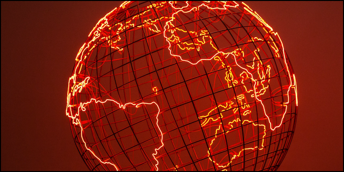

# 🌪️ 𝕰𝖓𝖙𝖗𝖔𝖕𝖎𝖈 𝕾𝖙𝖗𝖚𝖌𝖌𝖑𝖊

#### <i>“History is a relentless master. It has no present, only the past rushing into the future. To try to hold fast is to be swept aside.”</i>

The cause of the catastrophic world wars lay not in the limitations of capital and production, but in the structure of the political institutions of the time. The early and mid-twentieth century was marked by extraordinary opportunities for economic development due to the unstoppable march of technological progress.

As society became more complex, chaos and disorder, often referred to as entropy, permeated various aspects of social dynamics. Integrating entropy into the political system through reforms is possible, but the integration of entropy inevitably leads to the democratization of society and the emergence of new centers of influence. Faced with the risk of losing power, politicians resort to reactionary methods. In a desperate attempt to maintain their positions, they suppress freedom or engage in conflicts with neighboring countries, exporting entropy to the outside world.

World wars initiated by those in power eventually lead to their collapse. This tragic cycle of power struggles and resistance to progress can be traced back to the recent situation with Russian institutions. Politicians were faced with a choice: either to support development by accepting the emergence of new centers of influence in society, or to preserve the existing power structure by entering into a doomed conflict with the ever-changing reality. The decision of the Russian authorities is well known, and its consequences are evident in the situation in Ukraine.

This problem concerns not only Russia. China, reaching the middle-income level, is also gradually exhausting its economic potential within the old paradigm. Similarly, the Western system is struggling to adapt to the increasing complexity of Western society and international politics, which is also becoming an existential challenge for it. In such a complex environment, the best chances for survival and prosperity are those states that recognize the need to adapt and embrace the forces of progress.

***

##### ↩️ [Back](https://rozephyros.github.io/index-2.html) | 🌻 [Русская Версия](russian.md)
